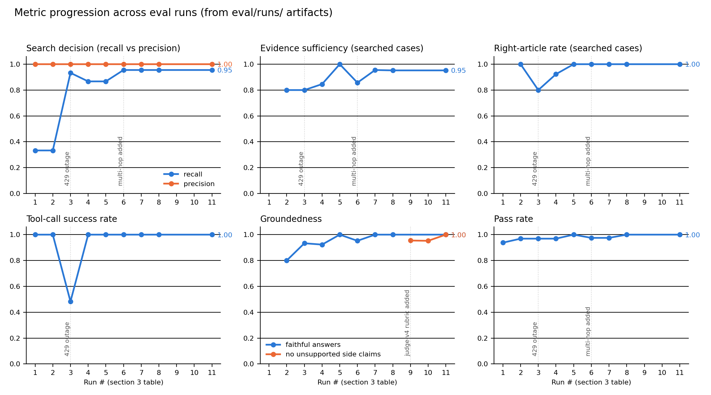

# Rationale • Prompt Engineering Take-Home Assignment

[wiki-chatbot-pi.vercel.app](https://wiki-chatbot-pi.vercel.app) • [github.com/amanchadha/wiki-chatbot](https://github.com/amanchadha/wiki-chatbot)

# Design Rationale

**Executive summary:** We use loop engineering to set up an eval-driven loop.
Start with a deliberately simple v0, build an eval that decomposes failures
into decision → retrieval → generation stages, and let clustered eval
failures pick every iteration target in a data-driven way.

**Time spent:** ~4 hours.

**Models:** agent `claude-opus-4-8` (adaptive thinking, effort low); judge
`claude-sonnet-5` — a different model to avoid self-grading bias.

## 1. Prompt-engineering approach

The prompt was not tuned based on intuition alone. Every change to
`prompts.py` addressed a recurring failure identified by the evals, was
assigned a version, and was validated by rerunning the same suite.

Key iterations:

- **v0 established the baseline:** The initial prompt was intentionally
  minimal: "Search when you're not certain." This tested whether the model
  could reliably judge its own knowledge. It could not. Opus 4.8 confidently
  answered volatile or highly specific questions incorrectly, including
  using an outdated Saturn moon count and naming the wrong Mercury Records
  founder.
- **v1 replaced confidence with fact-based rules:** Instead of asking the
  model to search when uncertain, the prompt defined categories that require
  verification, such as current officeholders, counts, statistics, exact
  dates, and named specifics. It also defined categories that could be
  answered directly, including arithmetic, language tasks, stable common
  knowledge, creative requests, and questions outside Wikipedia's scope.
- **The decision rules were deliberately balanced:** The search and
  no-search categories were presented symmetrically, without aggressive
  language such as "CRITICAL" or "MUST." Opus 4.8 follows strong
  instructions literally, so overemphasizing retrieval could have caused
  unnecessary searches and reduced precision. This change improved search
  recall from 0.33 to 0.93 while maintaining 1.0 precision with no spurious
  searches.
- **v1 added evidence discipline:** Once retrieval was used, the prompt
  required the answer to come from the retrieved text. If the evidence was
  insufficient, the model had to search again or state that the search did
  not confirm the answer. This prevented the model from retrieving evidence
  but then filling gaps from memory.
- **v1.1 defined behavior during retrieval failures:** For volatile facts,
  the model was instructed not to guess when Wikipedia was unavailable. For
  stable facts, it could answer from memory only if it clearly labeled the
  answer as unverified. This separated infrastructure failures from
  factual-answering behavior.
- **v1.3 enforced per-hop verification:** Multi-hop evals showed that the
  model sometimes verified the first step of a chain and answered the second
  from memory. The prompt was updated to require evidence for every hop
  before producing the final answer.
- **Some failures required tool changes, not prompt changes:** Plain-text
  Wikipedia extracts omit tables and infoboxes, making facts such as award
  winners and settlement populations unavailable to the model. Adding search
  snippets in v1.2 and infobox extraction in v1.3 fixed these retrieval
  gaps. No amount of prompt refinement could recover evidence that the tool
  never returned.

The main design principle was to use staged metrics to identify whether each
failure came from the search decision, retrieval layer, or answer
generation, and then change only the responsible layer.

## 2. Eval design

The eval was designed to identify where each failure occurred, not just
whether the final answer passed. Every case was graded across three stages:

- **Search decision:** Code calculates recall and precision by comparing
  actual tool use against `expect_search`. Each case is labeled required,
  not_required, or optional, with optional cases excluded from search
  precision and recall.
- **Retrieval quality:** The judge evaluates whether the retrieved evidence
  is sufficient and whether the system selected the correct article. Tool
  errors are measured separately in code so infrastructure failures do not
  appear as retrieval-quality failures.
- **Answer quality:** The judge evaluates overall correctness, faithfulness
  to the retrieved evidence, and whether abstention was appropriate.

Tracked metrics: every run's `summary.json` records, per dimension:

- **Search decision:** search recall and precision, spurious and missed
  search ids, multi-hop under-chaining, and mean searches per case (overall
  and multi-hop).
- **Retrieval quality:** evidence-sufficiency rate, right-article rate, and
  code-counted tool calls/errors (tool_error_rate), so infrastructure
  failures never masquerade as retrieval failures.
- **Answer quality:** pass rate overall and per category; verdicts
  (correct / partially_correct / incorrect / honest_abstention);
  **faithfulness (groundedness)**, i.e., whether the key claim is supported
  by the retrieved evidence rather than model memory; unsupported side
  claims (the hallucination rubric: rate and total count of specific
  details asserted beyond the evidence); and abstention in both directions
  (abstained-on-unanswerable, wrong abstentions).
- **Citations (cite mode):** citation coverage (complete/partial/uncited)
  and citation integrity (invented and misattributed citation ids).
- **Cost:** total input/output tokens per run.
- **Experimental sidecar:** per-case BLEU/ROUGE/BERTScore (BLEU and ROUGE
  dropped after the agreement analysis below; BERTScore deferred).

Every summary row carries `prompt_version` and `judge_version`, so metric
movements are attributable to a specific prompt or grading change.

Case design choices that mattered:

- **Stale-memory traps:** Cases involving officeholders and CEOs who changed
  in 2024 or 2025 test whether the model confidently answers from outdated
  memory. These cases distinguish confidence from correctness more
  effectively than a generic set of obscure facts.
- **Optional search cases:** `optional` is a deliberate third label, not
  uncertainty in the eval design. A question such as "Who painted the Mona
  Lisa?" is both stable common knowledge and a named fact about a specific
  work, so either searching or answering directly is reasonable. These cases
  are excluded from search precision and recall, but answer correctness and,
  when applicable, retrieval quality are still graded. In every final run,
  the model answered all four optional cases correctly from memory,
  demonstrating the calibrated restraint reflected in its 1.0 search
  precision.
- **Forced disambiguation:** Cases such as Mercury Records versus the planet
  Mercury, Odessa, Texas versus Odesa, Ukraine, and Java, South Dakota
  versus the programming language test whether retrieval selects the
  intended article rather than a more prominent entity with the same name.
- **Unanswerable questions:** Some cases are designed so that abstaining is
  the correct response. The eval measures both directions separately:
  whether the model abstains when evidence is unavailable and whether it
  incorrectly abstains when the question is answerable.
- **Multi-hop questions:** These were added only after the single-hop suite
  had converged. Each case specifies a minimum number of searches, and two
  cases use intermediate facts that are intentionally too obscure to skip
  using memory. Another ends in a genuine dead end, where the correct
  response is that the requested fact is not recorded.

Judge design and validation:

- **Eval notes override model knowledge:** Case-level notes are
  authoritative when they conflict with the judge's internal knowledge. The
  judge must flag the disagreement but grade according to the eval evidence.
  This is essential for reliably grading stale-memory traps and source
  inconsistencies.
- **Judge versions are tracked:** Judge prompt changes are versioned from
  judge-v1 through judge-v5, covering both default and citation modes. This
  preserves comparability across runs and makes grading changes explicit.
- **Completed runs can be regraded:** The `--rejudge` mode applies a newer
  judge to saved transcripts from an earlier run. This allows the grading
  rubric to improve without rerunning the agent or changing its recorded
  behavior.
- **Human validation checks the judge:** A blind human review of 10 cases
  was selected before any judge verdicts were examined. The human grades
  matched the judge on all 10 cases.

We prefer an LLM-as-a-judge because it can evaluate factual correctness,
evidence faithfulness, and appropriate abstention in context, which simple
reference-overlap metrics cannot reliably capture. However, we still
evaluated traditional lexical and semantic metrics empirically rather than
dismissing or adopting them by assumption.

Traditional lexical/semantic metrics findings:

- **Lexical metrics:**
  - **BLEU and ROUGE were tested and rejected:** They were treated as
    falsifiable metrics rather than assumed to be useful, which aligns with
    our expectations. The baseline's incorrect answer scored above the
    average correct answer on ROUGE-1, while correct answers ranged from
    0.00 to 0.76. Because fluent but incorrect answers can overlap heavily
    with short reference answers, no useful threshold separated correct from
    incorrect responses.
- **Semantic metrics:**
  - **BERTScore was deferred:** Its model files could not be downloaded in
    the development environment, but it can be recomputed later from the
    saved artifacts.
  - **MoverScore was excluded:** Its dependencies could not be built
    successfully in the development environment.

## 3. Key iterations

| # | Config | Pass | Search recall / precision | What it taught us |
|---|---|---|---|---|
| 1 | v0, pre-rubric judge (superseded) | 0.94 | 0.33 / 1.0 | First recall signal; judge too shallow to attribute failures |
| 2 | v0 baseline, rubric judge | 0.969 | 0.33 / 1.0 | Systematic under-searching masked by lucky memory (9 latent passes); pass rate alone is misleading |
| 3 | v1 verify-volatile | 0.969 | 0.93 / 1.0 | Fact-kind trigger works; run polluted by 52% Wikipedia 429s → infra is a failure mode too |
| 4 | v1.1 outage-fallback + tool retries | 0.969 | 0.87 / 1.0 | Clean read; two genuine failures left: table-stripped extracts (r12), alternate-title shortcut (r02) |
| 5 | v1.2 snippets + follow-up clause | **1.0** (32/32) | 0.87 / 1.0 | Single-hop converged; verification now costs no more tokens than v0 |
| 6 | v1.2 + 8 multi-hop cases (baseline) | 0.975 | 0.955 / 1.0 | Chain collapse into memory (mh-04) and infobox-blind retrieval (mh-06); single-hop unregressed |
| 7 | v1.3 chain-verify + infobox | 0.975 | 0.955 / 1.0 | Multi-hop 8/8, zero unfaithful; one miss (r09) traced to Wikipedia's own article contradicting itself (prose 1906 vs infobox 1907) |
| 8 | v1.3 confirmation (identical config) | **1.0** (40/40) | 0.955 / 1.0 | Run-to-run spread ≈ 0 on all metrics |
| 9–10 | judge-v4 re-judge of runs 7–8 (frozen transcripts, no agent re-run) | unchanged | unchanged | New side-claims hallucination rubric: 1 unsupported side detail per run (~5% of searched answers); every judge-v2-era grade reproduced exactly |
| 11 | v1.4 `--cite` baseline (+ judge-v5 re-judge) | **1.0** (40/40) | 0.955 / 1.0 | Citation coverage 1.0, zero invented/misattributed citations; default-mode metrics identical (cite instructions append only under the flag); side claims dropped to 0/21 — requiring a marker per claim appears to suppress memory embellishment |

(A separate partial run, aborted by an API-credit outage, is flagged invalid
in `history.jsonl`.)

### Metric progression

All values are read from the checked-in run artifacts (regenerate with
`python eval/make_plots.py`); runs 9-10 replay runs 7-8's frozen
transcripts, so behavior metrics are plotted once and the side-claims
series starts at run 9, where its rubric was introduced. Reading the
trends: search recall triples (0.33 to 0.95) while precision never leaves
1.0; evidence sufficiency, right-article rate, faithfulness, and
side-claim groundedness all climb to or near ceiling; tool-call success is
flat at 1.0 apart from the annotated run-3 Wikipedia outage.

**Every dip in the plots, explained.** The dips are real and annotated
rather than smoothed away:

- **Run 3, tool-call success 1.0 to 0.48 (and sufficiency / right-article
  to 0.8):** Wikipedia rate-limited 15 of 29 tool calls mid-run. This was
  infrastructure, not model behavior; retries, backoff, and throttling in
  v1.1 returned tool success to 1.0 for every subsequent run, and the
  `tool_error_rate` metric was added so infra failures can never again
  masquerade as retrieval-quality failures.
- **Runs 4-5, recall 0.93 to 0.87:** the borderline stable-historical-year
  cases (r08/r09) flickered between searching and answering correctly from
  memory. This is the accepted noise band, roughly one case wide, kept in
  preference to trigger wording aggressive enough to endanger the 1.0
  precision streak.
- **Run 6, sufficiency 1.0 to 0.86 and pass 1.0 to 0.975:** eight harder
  multi-hop cases entered the suite, deliberately resetting saturated
  metrics. The new failures (chain collapse into memory, infobox-blind
  retrieval) were exactly what the category was designed to surface, and
  the v1.3 fixes recovered both metrics on the same expanded suite.
- **Run 7, pass 0.975:** the single miss (r09) traced to Wikipedia's own
  article contradicting itself (prose 1906 vs infobox 1907); the model's
  answer was faithful to retrieved evidence. Graded as a miss under the
  then-current notes; the calibration is disclosed in the transparency
  note above.

**Metrics not yet at full performance, and why.** Not every line ends at
1.0, deliberately:

- **Search recall, 0.955:** the r08 noise band remains. The model
  occasionally answers a stable, decades-old year from memory (correctly
  in every observed run). Closing the last 4.5 points would require
  trigger wording aggressive enough to risk spurious searches, trading a
  cosmetic recall gain for a real precision loss.
- **Evidence sufficiency, 0.952:** the one "insufficient" case in every
  final run is mh-08, the deliberate dead-end chain whose correct outcome
  is finding no evidence. Its abstention passes; the metric honestly
  records that retrieval found nothing, because there is nothing to find.
  Effective ceiling given the case design. The genuine (unmeasured
  residual) limit is long-article truncation: facts deeper than the
  6,000-character extract cut, which snippets and infobox extraction
  mitigate but do not eliminate.
- **Side-claim groundedness, 0.95 in default mode (runs 9-10):** roughly
  one searched answer per run carries a small unverified embellishment.
  Measured, tracked, and consciously left unfixed in default mode (the
  prompt remedy risked degrading answer quality for a two-claim problem);
  citation mode (run 11) drives it to 1.0.
- **Recall and sufficiency share one more caveat:** both are measured on a
  40-case suite that the prompt has been iterated against. The honest
  expectation is that all near-ceiling numbers would drop on a larger
  held-out set, which is why expanded, repeated evals are the P0 item in
  section 5.

**Transparency note on the final 40/40 score:** run 8's perfect score came
after two eval-side calibrations made between runs 7 and 8 — (a) r09's
grading notes now accept either 1906 or 1907 because the Wikipedia article
itself states both (our infobox feature exposed the discrepancy; the model's
answer was faithful to retrieved evidence), and (b) a metric labeling fix so
the by-design dead-end abstention isn't counted as a wrong abstention. The
agent configuration was byte-identical across runs 7 and 8; without the r09
calibration, run 8 would read 39/40 with the one miss being a
faithful-to-evidence answer to an internally inconsistent source. We changed
the ruler, not the system — and are saying so.

## 4. Where it succeeds, where it fails, what we learned

Where it succeeds:

- **Search decisions:** The final system achieved 0.96 recall and 1.0
  precision, meaning it retrieved information when needed with almost no
  unnecessary searches.
- **Disambiguation:** When retrieval was used, the system consistently
  selected the correct article, achieving a right-article score of 1.0.
- **Evidence grounding:** The final configuration had no faithfulness
  violations. Answers remained supported by the retrieved evidence rather
  than relying on unverified model memory.
- **Abstention:** The system correctly declined to answer unanswerable
  questions and multi-hop questions whose evidence chains ended without a
  supported answer.
- **Multi-hop reasoning:** It successfully completed chained searches,
  including cases where intermediate answers were intentionally too obscure
  to recover reliably from memory.
- **Citation mode:** The optional `--cite` mode achieved complete citation
  coverage with no invented or misattributed citations. It also eliminated
  unsupported side claims, reducing them from roughly one per default-mode
  run to 0 out of 21 searched answers. Requiring a citation for each claim
  appears to discourage the model from adding details from memory.

Known residual failures:

- **Occasional missed searches:** The model sometimes answers stable,
  decades-old historical dates from memory despite the prompt's "specific
  years" search trigger. These answers have remained correct, and the
  roughly one-case variation was accepted because stronger wording could
  reduce search precision.
- **Unsupported side details:** Roughly 5% of searched answers contain a
  small detail not supported by the retrieved evidence, such as adding
  "France/PSG" or providing a full date when the source includes only the
  year. The observed details happened to be correct, but they represent the
  same kind of unverified embellishment that could eventually produce an
  error. The rate is tracked across runs, with a prompt-level fix ready if
  it increases on a larger eval set.
- **Long-article truncation:** Relevant facts located deep within long
  Wikipedia articles may fall beyond the 6,000-character extract limit.
  Search snippets and infobox extraction recover many facts omitted from the
  main extract, especially those in tables and infoboxes, but they do not
  cover every case.
- **Changing or inconsistent sources:** Wikipedia content changes over time
  and can occasionally contradict itself. In the r09 case, the article
  listed different years in its prose and infobox. The eval handles known
  conflicts by grading against the retrieved evidence and documenting
  acceptable answers, but it cannot eliminate source-level inconsistency.

Biggest lessons:

- **Use staged metrics, not pass rate alone:** The v0 system passed 97% of
  cases, but that number hid a major search-decision failure. It skipped
  retrieval for two-thirds of the facts that required verification and often
  passed only because the model happened to recall the correct answer.
  Separately measuring search decisions, retrieval quality, and answer
  quality exposed these latent failures.
- **Trigger search based on the type of fact:** The model's confidence was
  not a reliable signal because it could be highly confident about stale or
  incorrect information. Search decisions became more reliable when based on
  observable fact categories, such as current officeholders, changing
  statistics, exact dates, and named specifics, rather than the model's
  subjective certainty.
- **Fix the right layer:** Several apparent prompt failures were actually
  retrieval problems. Rate limits prevented evidence from being returned,
  while plain-text Wikipedia extracts omitted tables and infoboxes
  containing facts such as award winners and population figures. Adding
  retries, search snippets, and infobox extraction addressed these failures
  more effectively than additional prompt instructions.
- **Evaluate the evaluator:** Judge prompts and rubrics can have blind
  spots, so they should be versioned and tested like the agent itself.
  Replaying updated judges over frozen transcripts allowed us to improve
  grading and add hallucination analysis without rerunning the agent.
  Measuring the roughly 5% unsupported-side-claim rate before changing the
  prompt also prevented us from overcorrecting for a small residual issue
  and potentially reducing overall answer quality.

## 5. Priority-sorted Feature Roadmap

- **[P0] Larger dev set and held-out evaluation:** The current 40-case
  suite, used as a dev set to optimize the loop, should be expanded for
  broader failure coverage, and a separate held-out set of real-world
  queries should be added to assess real-world performance. Run each
  configuration multiple times to measure variance and confidence
  intervals.
- **[P0] Human-judge inter-annotator agreement:** While human-judge
  correlation was established with 10 samples in this exercise, as the
  dataset scales, it is important to have a human independently grade a
  stratified 20-30% random sample, then measure agreement with the LLM
  judge using percent agreement and a relevant per-domain inter-annotator
  agreement metric such as Cohen's kappa. Review disagreements to identify
  systematic judge errors and refine the rubric.
- **[P1] Latency optimization:** Measure and reduce end-to-end and
  per-tool-call latency, especially for interactive use cases. Multi-hop
  queries require sequential searches and can take ~30s, as seen
  occasionally in the Vercel demo; potential improvements include parallel
  retrieval for independent hops, prompt/KV caching of the static prefix
  plus Wikipedia response caching, latency-aware search budgets with early
  stopping, adaptive backoff instead of the fixed throttle, streaming for
  perceived latency, etc.
- **[P1] Explicit query rewriting and decomposition:** The current system
  relies on instruction-driven reformulation (retry with a more specific
  article title, follow surfaced alternate titles) and the model's
  emergent chain decomposition, which the 40-case suite never falsified
  (multi-hop 8/8). A larger held-out set with harder cases (>2-hop chains,
  low-recall queries where the first search misses) will likely justify
  dedicated machinery: an explicit query-rewrite step triggered on
  retrieval misses, and a lightweight planner that decomposes multi-hop
  questions into sub-queries up front, which also unlocks the parallel
  retrieval called out under latency optimization.
- **[P1] Automated prompt optimization:** Compare the loop-engineering
  approach with Automatic Prompt Optimization
  ([Pryzant et al., 2023](https://arxiv.org/abs/2305.03495)) and
  AlphaEvolve-style prompt evolution
  ([Novikov et al., 2025](https://arxiv.org/abs/2506.13131)) using the
  same eval suite and token budget. I have used AlphaEvolve's evolutionary
  approach at DeepMind, while APO provides a complementary
  textual-feedback loop.
- **[P2] Performance dashboard with failure-analysis:** Build a dashboard
  over the structured transcripts to analyze performance and bucketize
  failures by category, pipeline stage, prompt version, model, etc.
- **[P2] Multilingual coverage:** Extend the English-only suite across
  languages and evaluate retrieval, disambiguation, grounding, and
  abstention separately for each language.
- **[P3] Specialized domain evals:** Add healthcare, legal, and finance
  cases with stricter standards for source quality, faithfulness,
  uncertainty, and abstention. Re-measure judge agreement against domain
  experts (with at least a stratified 20-30% randomly sampled data
  slice), such as clinicians, lawyers, and financial analysts, using a
  relevant per-domain inter-annotator agreement metric.

## Appendix A: Per-run metrics and change log

All values from the checked-in `eval/runs/` artifacts (`summary.json` per
run; "-" = not recorded by that era's judge or not applicable). Runs 1-5
grade 32 cases; runs 6-11 grade 40 (multi-hop added). Tool-error rates for
runs 1-3 were computed retroactively from the saved tool results, since the
`tool_error_rate` metric was added in run 4's harness.

| Run | Config (n cases) | Judge | Pass | Recall | Prec. | Evid. suff. | Right art. | Tool err. | Unfaithful | Side claims | Prompt / tool / judge change in this iteration |
|---|---|---|---|---|---|---|---|---|---|---|---|
| 1 | v0 (32) | pre-rubric | 0.938 | 0.333 | 1.0 | - | - | 0.0 | - | - | Baseline: minimal "search when you're not certain" prompt |
| 2 | v0 (32) | judge-v1 | 0.969 | 0.333 | 1.0 | 0.80 | 1.0 | 0.0 | 1 | - | Judge upgraded to rubric judge (4 fields, per-notch examples); prompt unchanged |
| 3 | v1 (32) | judge-v1 | 0.969 | 0.933 | 1.0 | 0.80 | 0.80 | 0.517 | 1 | - | Prompt: fact-kind trigger lists replace confidence; evidence-discipline block. Run polluted by Wikipedia 429s |
| 4 | v1.1 (32) | judge-v2 | 0.969 | 0.867 | 1.0 | 0.846 | 0.923 | 0.0 | 1 | - | Prompt: outage-fallback policy. Tool: 429/503 retries + throttle. Judge-v2: labeled-unverified carve-out |
| 5 | v1.2 (32) | judge-v2 | **1.0** | 0.867 | 1.0 | **1.0** | **1.0** | 0.0 | 0 | - | Prompt: follow alternate titles before answering. Tool: search snippets (table-borne facts) |
| 6 | v1.2 (40) | judge-v2 | 0.975 | 0.955 | 1.0 | 0.857 | 1.0 | 0.0 | 1 | - | No config change: 8 multi-hop cases added to the suite |
| 7 | v1.3 (40) | judge-v2 | 0.975 | 0.955 | 1.0 | 0.955 | 1.0 | 0.0 | 0 | - | Prompt: per-hop chain verification. Tool: infobox extraction |
| 8 | v1.3 (40) | judge-v2 | **1.0** | 0.955 | 1.0 | 0.952 | 1.0 | 0.0 | 0 | - | No config change: confirmation run (after the two disclosed eval-side calibrations) |
| 9 | v1.3 replay (40) | judge-v4 | 0.975 | 0.955 | 1.0 | 0.955 | 1.0 | 0.0 | 0 | 1/22 | Judge-only replay of run 7's frozen transcripts; judge-v4 adds side-claims rubric |
| 10 | v1.3 replay (40) | judge-v4 | **1.0** | 0.955 | 1.0 | 0.952 | 1.0 | 0.0 | 0 | 1/21 | Judge-only replay of run 8's frozen transcripts |
| 11 | v1.4 cite (40) | judge-v5 | **1.0** | 0.955 | 1.0 | 0.952 | 1.0 | 0.0 | 0 | **0/21** | Cite mode: citation instructions appended (default prompt unchanged); judge-v5 = v4 + citation rubrics. Citation coverage 1.0, zero invented/misattributed |

Column notes: Pass = verdict `correct` or appropriate `honest_abstention`;
Recall/Prec. = search decision vs `expect_search` (optional cases
excluded); Evid. suff. and Right art. over searched cases (run 3's dips
are the 429 outage; runs 7-11 include the by-design dead-end case mh-08,
which caps sufficiency at 0.95); Unfaithful = count of searched answers
whose key claim exceeded the evidence; Side claims = searched answers with
unsupported side details (judge-v4+ only). Later prompt refinements
(v1.5/v1.5.1: claim-level citation placement, one source title per line)
shipped after run 11 and changed cite-mode output formatting only; they
were verified on the live demo rather than by a full re-run.
